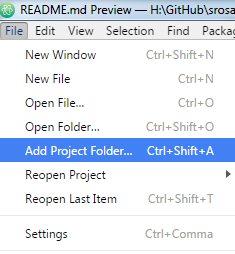
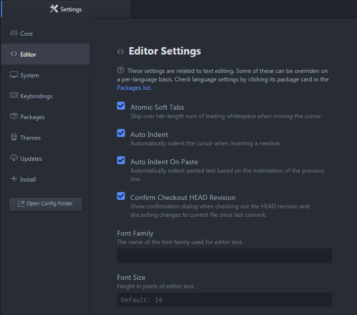
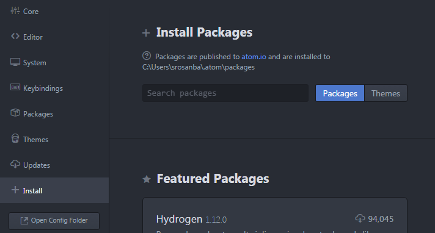

# Overview

Atom is a free text editor from GitHub. Much like TextPad, UltraEdit, and other text editors, there are many ways to customize Atom to play nicely with SAS. Continue reading if you're interested in learning more.

# Contents

1. <a href="#install-atom">Install Atom</a>
1. <a href="#editor-settings">Editor Settings</a>
1. <a href="#package-settings">Package Settings</a>
1. <a href="#adding-packages">Adding Packages</a>
1. <a href="#showing-off">Showing Off</a>

# Install Atom

If you'd like a little hand-holding, check out the Atom tuturials on YouTube from [LevelUpTuts](https://www.youtube.com/watch?v=WWwBQQOGllo&list=PLLnpHn493BHHf0w8uGu9NM8LPf498ZvL_).

On the other hand, you could skip the tutorials and go straight to the [download page](https://atom.io/).

Once Atom has been installed, use `File > Add Project Folder` to open a folder containing a SAS program.

This action should add a directory tree on the left side of Atom. From this tree, double-click on an individual SAS program to open it.

# Editor Settings

Most of the default editor options are what you want them to be. To change editor settings, select `File > Settings > Editor`.

Options are sorted alphabetically. Here are a few options that I would recommend changing from the default.

1. Enable `Scroll Past End`.
1. Enable `Show Indent Guide`.
1. Set `Tab Length = 3`.
1. Set `Tab Type = soft`.

# Package Settings

Packages allow you to extend the base functionality of Atom. Several packages come pre-installed. Each package has its own settings. Let's practice editing package settings. Select `File > Settings > Packages`.

In the search box, type the package name listed below and press Enter.

1. `autocomplete-plus`
   1. To disable autocomplete, click the `Settings` button.   
      
   Disable the option `Show Suggestions on Keystroke`.   
   
1. `welcome`
   1. To prevent the Welcome tab from displaying every time you open Atom, click the `Settings` button.   
      
   Disable the option `Show On Startup`.   
      

# Adding Packages

To get the most out of Atom for SAS, you will want to install the following packages. The more of these packages you install, the nicer Atom will work for you in SAS. Select `File > Settings > Install`.

In the search box, type the package name listed below and press Enter.

1. `language-sas`
   1. This package adds SAS syntax highlighting. Once you've installed it the SAS file that you have open should look a little different.
1. `sublime-style-column-selection`
   1. This package allows you to edit multiple lines simultaneously. Once you've installed the package:
      1. Use the Control key to create cursors in multiple random locations.
      1. Use the Alt key to create multiple cursors at the same location in several consecutive lines.
1. `atom-shell-commands`
   1. This package allows you to submit SAS jobs from within Atom.
   1. Once the package has been installed, open your config file by selecting `File > Config`. This file is named `config.cson`. Move your cursor to the very bottom of this file.
   1. Next, open the `atom-shell-commands.cson` file included in this repository. Do so by right-clicking on [this link](https://github.com/srosanba/sas-atom/blob/master/atom-shell-commands.cson) and opening in a new tab. Select the pencil icon at right. Use `ctrl-a` to select all.
   1. Copy/paste the commands from `atom-shell-commands.cson` into the end/bottom of the Atom `config.cson` file. Save and close `config.cson`.
   1. Test these updates by navigating to your SAS program and pressing `ctrl-shift-5`. This should result in some command-prompt-like lines being generated near the bottom of your Atom editor (e.g., Connecting to the SAS Grid server...). After 15-20 seconds you should see a message indicating `[Finished in xx.xx seconds]`.
1. `related`
   1. This package allows you to open your LOG and LST files without touching your mouse.
   1. Once the package has been installed, from the top menu select `Packages > Related > Edit related patterns`. This file is named `related-patterns.cson`.
   1. Next, open the `related.cson` file included in this repository. Do so by right-clicking on [this link](https://github.com/srosanba/sas-atom/blob/master/related.cson) and opening in a new tab. Select the pencil icon at right. Use `ctrl-a` to select all.
   1. Copy/paste the commands at the end/bottom of the Atom `related-patterns.cson` file. Save and close `related-patterns.cson`.
   1. Test these updates by navigating to your SAS program and pressing `ctrl-shift-r`. This should result in a list including your LOG and LST file. Use the up/down arrows to select the file of interest and press Enter.
      1. Note: this feature only works if the SAS program has been opened as part of a project folder (i.e., if you can see the SAS/LOG/LST files in the tree at left). If you attempt the `ctrl-shift-r` command on a program which is not visible in the tree you will lock up Atom. You have been warned!
1. `file-watcher`
   1. This packages allows your LOG and LST files to update automatically.
   1. Once the package has been installed, select `Settings`. I would recommend you enable `Prompt on Change`.
   1. Test this update by opening your SAS, LOG, and LST files. Then run the SAS program. You should get some pop-ups.

# Showing Off

Now we put the above packages through their paces.

1. Use `File > Open Project Folder` to open a folder containing a SAS program.
1. Double-click in the tree at left to open the SAS program.
1. Use `ctrl-shift-5` to submit the program.
1. Use `ctrl-shift-r` to open the LOG and LST files.
1. Use `Alt-Tab` to return focus to the SAS program.
1. Use `ctrl-shift-5` to resubmit the program.
1. Acknowledge the pop-ups to see your updated LOG and LST files.
1. Do a happy dance.
